# Flow API Documentation
## Overview
This document provides comprehensive API documentation for the Flow coroutine library, including interface contracts, implementation details, and usage patterns.
## Core Interfaces
### IKernel - Execution Engine
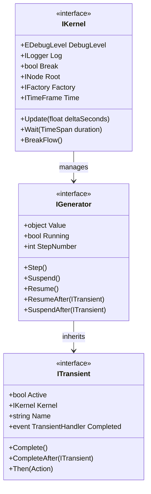
### IFactory - Object Creation
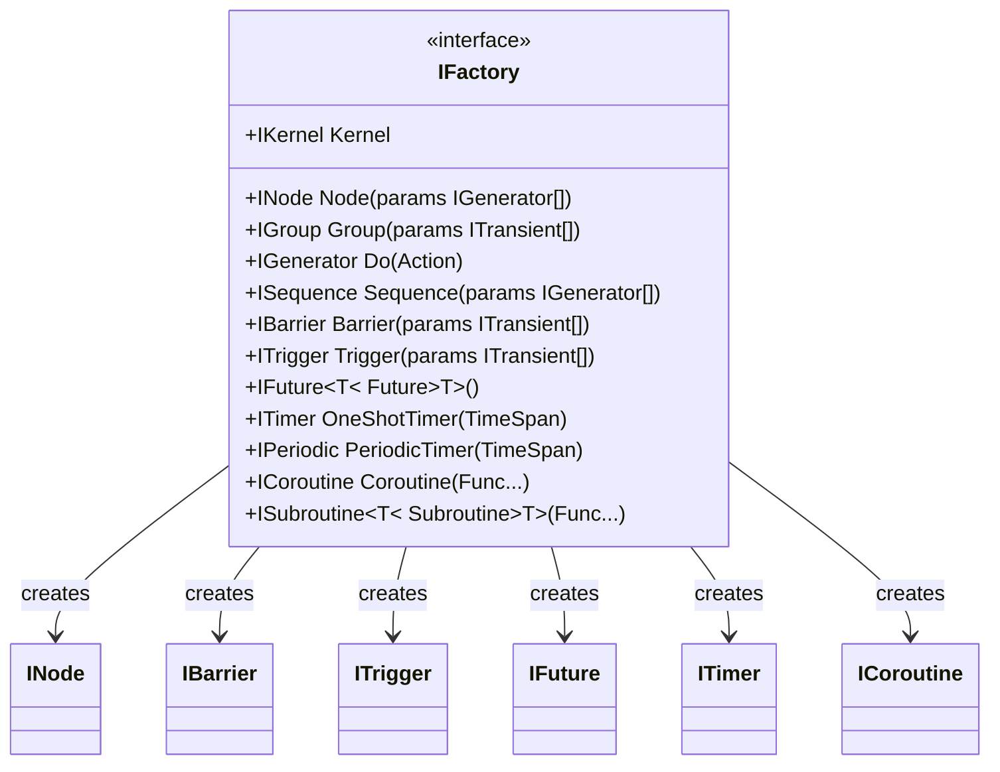
## Flow Control Primitives
### Synchronization Primitives
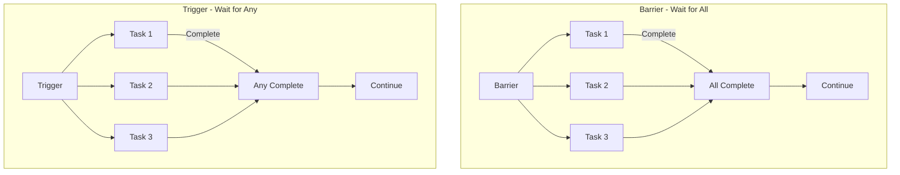
### Timing Primitives
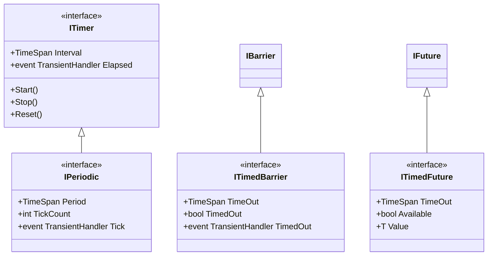
## Execution Flow Diagrams
### Kernel Execution Cycle
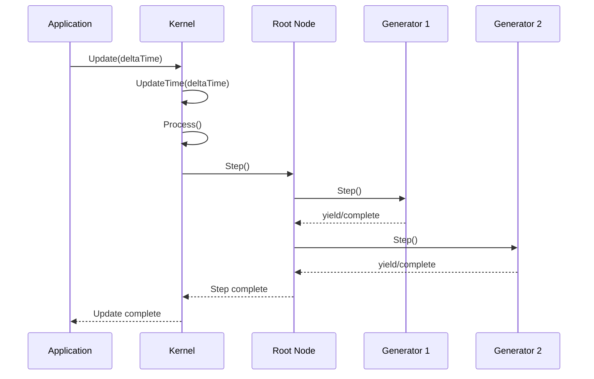
### Generator Lifecycle Management
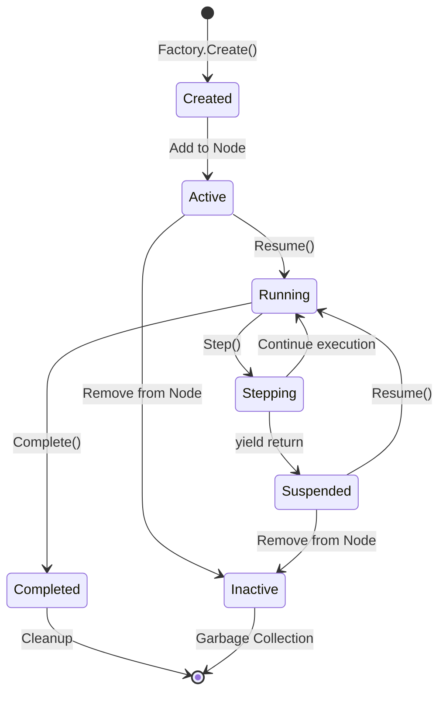
### Event Propagation
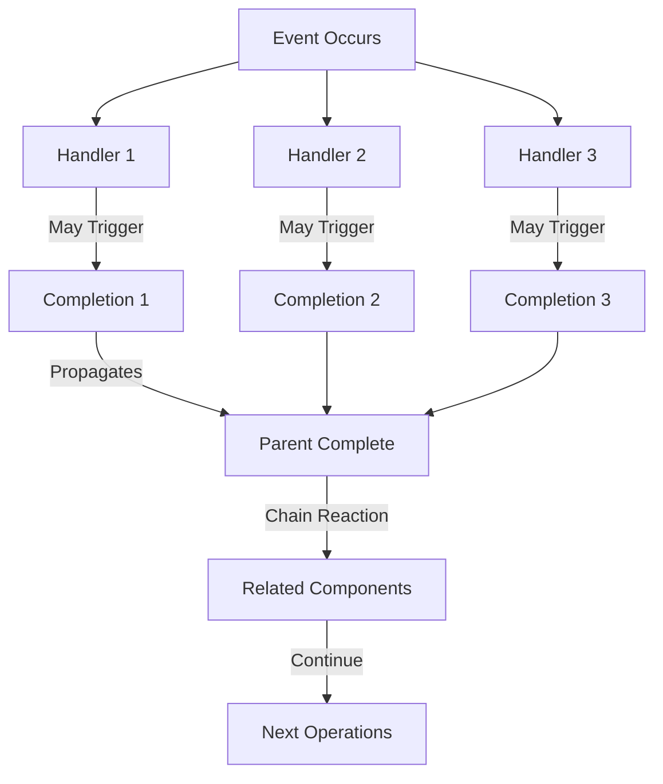
## Advanced Patterns
### Coroutine Composition
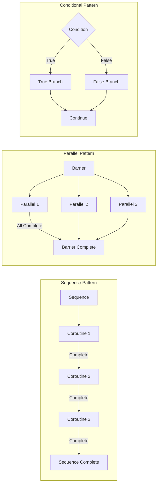
### Future/Promise Chain
```mermaid
sequenceDiagram
participant C as Consumer
participant F1 as Future<Input>
participant P as Processor 
participant F2 as Future<Output>
participant R as Result Handler
C->>F1: Create input future
C->>P: Start processing
P->>F1: ResumeAfter(inputFuture)
Note over P: Processor suspended
C->>F1: Set input value
F1->>P: Resume processor
P->>P: Process input
P->>F2: Set output value
F2->>R: Notify result available
R->>F2: Get result value
```
## Error Handling Patterns
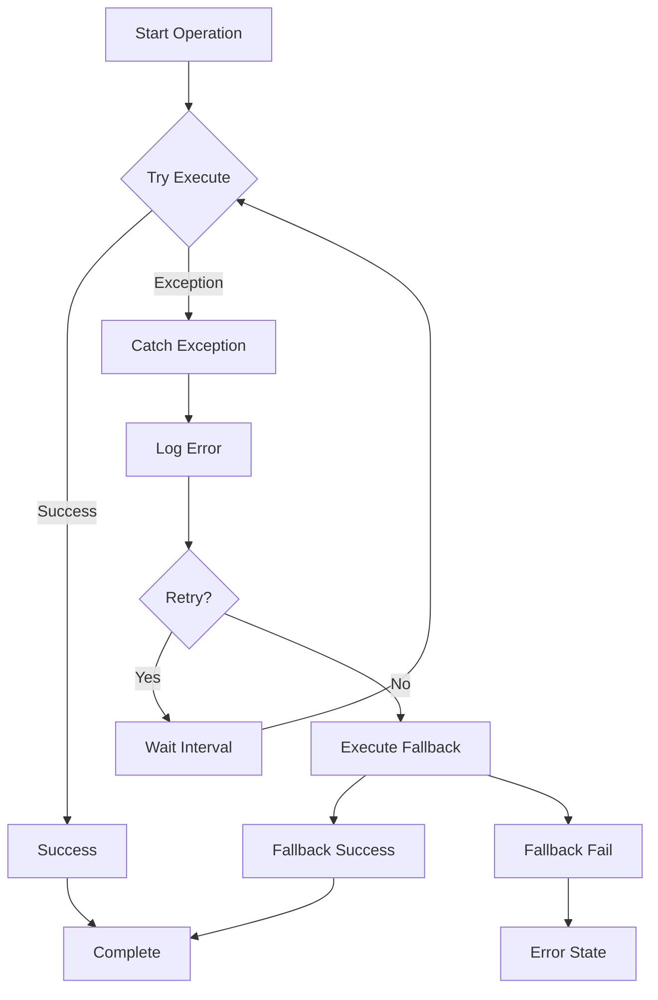
## Best Practices
### Resource Management
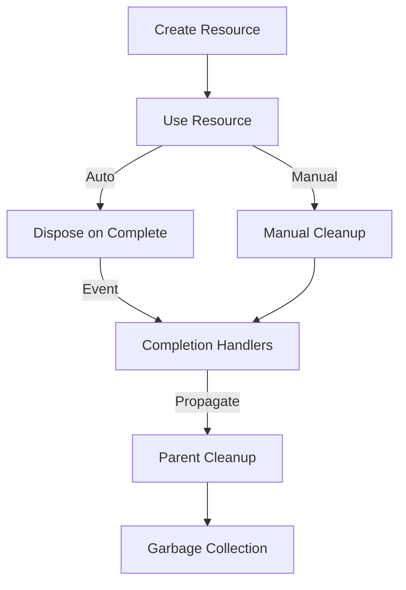
### Performance Optimization
1. **Minimize Allocations**: Reuse generators and objects where possible
2. **Efficient Stepping**: Avoid deep nesting of sequences
3. **Memory Management**: Use completion events for cleanup
4. **Verbose Logging**: Check verbosity levels before expensive operations
### Thread Safety
Flow assumes single-threaded execution. For multi-threaded scenarios:
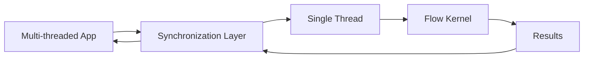
The synchronization layer should marshal all Flow operations to a single thread to maintain consistency.