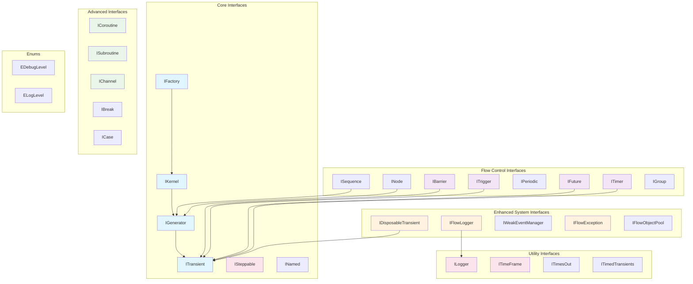
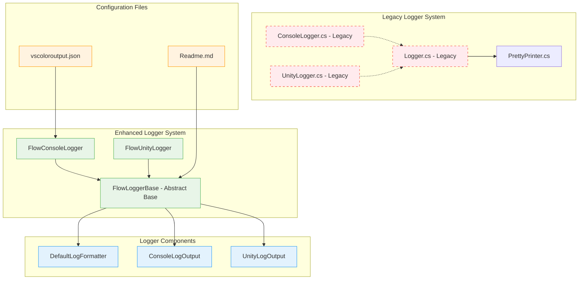
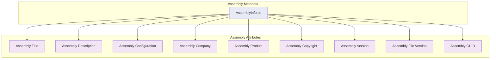
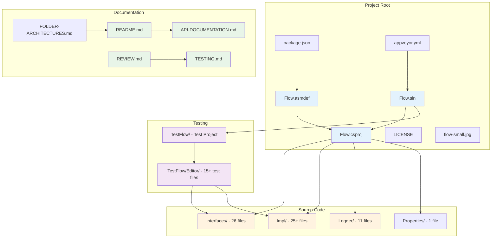
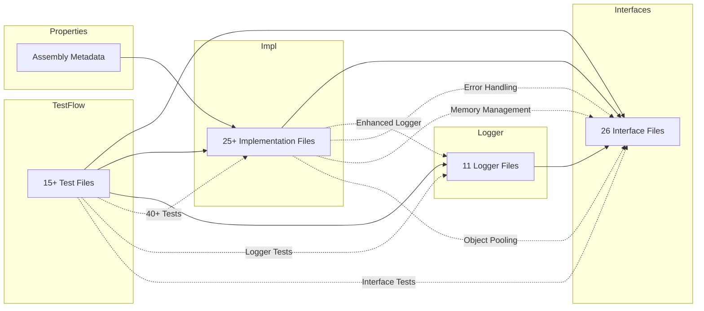

# CsharpFlow Folder Architecture Documentation
This document provides detailed Mermaid diagrams for each major folder in the CsharpFlow project, showing the relationships and dependencies between components.
## Interfaces/ Folder Architecture

## Impl/ Folder Architecture
```mermaid
graph TB
subgraph "Core Implementations"
Kernel[Kernel]
Generator[Generator]
Transient[Transient]
Factory[Factory]
Node[Node]
Group[Group]
end
subgraph "Flow Control Implementations"
Barrier[Barrier]
Trigger[Trigger]
Future[Future]
Timer[Timer]
Periodic[Periodic]
Sequence[Sequence]
TimedBarrier[TimedBarrier]
TimedFuture[TimedFuture]
TimedTrigger[TimedTrigger]
end
subgraph "Advanced Implementations"
Coroutine[Coroutine]
Subroutine[Subroutine]
Channel[Channel]
BlockingChannel[BlockingChannel]
Break[Break]
Case[Case]
end
subgraph "Enhanced System Implementations"
DisposableTransient[DisposableTransient]
WeakEventManager[WeakEventManager]
FlowExceptions[FlowExceptions]
FlowErrorHandler[FlowErrorHandler]
FlowObjectPool[FlowObjectPool]
end
subgraph "Utilities"
Create[Create]
Extension[Extension]
Exception[Exception]
TimeFrame[TimeFrame]
VolatileBool[VolatileBool]
SpinWait[SpinWait]
LoggerFacade[LoggerFacade]
GlobalSuppressions[GlobalSuppressions]
end
subgraph "Detail"
Detail[Detail]
end
%% Core relationships
Generator --> Transient
Kernel --> Generator
Factory --> Kernel
%% Flow control relationships
Barrier --> Transient
Trigger --> Transient
Future --> Transient
Timer --> Transient
Sequence --> Generator
Node --> Generator
%% Timed variants
TimedBarrier --> Barrier
TimedFuture --> Future
TimedTrigger --> Trigger
%% Enhanced systems
DisposableTransient --> Transient
FlowObjectPool --> FlowErrorHandler
WeakEventManager --> DisposableTransient
%% Utilities support all
Create --> Factory
Extension --> Generator
TimeFrame --> Kernel
%% Styling
classDef coreImpl fill:#e3f2fd
classDef flowImpl fill:#f1f8e9
classDef advancedImpl fill:#fce4ec
classDef enhancedImpl fill:#fff8e1
classDef utilityImpl fill:#f3e5f5
class Kernel,Generator,Transient,Factory coreImpl
class Barrier,Trigger,Future,Timer flowImpl
class Coroutine,Subroutine,Channel advancedImpl
class DisposableTransient,WeakEventManager,FlowExceptions enhancedImpl
class Create,Extension,TimeFrame utilityImpl
```
## Logger/ Folder Architecture

## TestFlow/ Folder Architecture

```mermaid
graph TB
subgraph "Test Foundation"
TestBase[TestBase - Base Test Class]
GetParamName[GetParamName - Utility]
end
subgraph "Core System Tests"
TestKernel[TestKernel]
TestLog[TestLog]
TestFlowExtra[TestFlowExtra]
end
subgraph "Flow Control Tests"
TestBarrier[TestBarrier]
TestTrigger[TestTrigger]
TestChannel[TestChannel]
TestTimers[TestTimers]
TestSequenceTopology[TestSequenceTopology]
end
subgraph "Advanced Pattern Tests"
TestConditionals[TestConditionals]
TestLoops[TestLoops]
TestResumeAfter[TestResumeAfter]
TestEventStream[TestEventStream]
TimerTimedWait[TimerTimedWait]
end
subgraph "Enhanced System Tests"
TestAdvancedScenarios[TestAdvancedScenarios - 20 Tests]
TestNewSystemsIntegration[TestNewSystemsIntegration - 20 Tests]
end
subgraph "Project Configuration"
FlowTestsAsmdef[FlowTests.asmdef - Unity]
TestFlowAsmdef[TestFlow.asmdef - Unity]
TestFlowCsproj[TestFlow.csproj - Project]
PackagesConfig[packages.config - NuGet]
end
%% Test inheritance
TestKernel --> TestBase
TestBarrier --> TestBase
TestTrigger --> TestBase
TestChannel --> TestBase
TestTimers --> TestBase
TestConditionals --> TestBase
TestLoops --> TestBase
TestResumeAfter --> TestBase
TestSequenceTopology --> TestBase
TestEventStream --> TestBase
TestFlowExtra --> TestBase
TestLog --> TestBase
TestAdvancedScenarios --> TestBase
TestNewSystemsIntegration --> TestBase
%% Utilities
GetParamName --> TestBase
TimerTimedWait --> TestBase
%% Configuration relationships
FlowTestsAsmdef --> TestBase
TestFlowCsproj --> FlowTestsAsmdef
PackagesConfig --> TestFlowCsproj
%% Styling
classDef foundation fill:#e8eaf6
classDef coreTest fill:#e1f5fe
classDef flowTest fill:#e8f5e8
classDef advancedTest fill:#fff3e0
classDef enhancedTest fill:#f3e5f5
classDef config fill:#fce4ec
class TestBase,GetParamName foundation
class TestKernel,TestLog,TestFlowExtra coreTest
class TestBarrier,TestTrigger,TestChannel,TestTimers flowTest
class TestConditionals,TestLoops,TestResumeAfter advancedTest
class TestAdvancedScenarios,TestNewSystemsIntegration enhancedTest
class FlowTestsAsmdef,TestFlowCsproj,PackagesConfig config
```

## Properties/ Folder Architecture

## Overall Project Architecture

## Cross-Folder Dependencies

## Ubuntu Compatibility
Yes, this will work under Ubuntu! Here's the compatibility analysis:
### ** Full Ubuntu Support**
**Runtime Requirements:**
- **.NET Framework 4.8** - Supported via Mono
- **Mono Runtime** - Native Ubuntu support
- **.NET 5+/6+/7+** - Full native Ubuntu support
**Development Tools:**
- **MonoDevelop** - Native Ubuntu IDE
- **Visual Studio Code** - Excellent C# support on Ubuntu
- **JetBrains Rider** - Full Ubuntu support
- **Command Line** - `mcs`, `mono`, `dotnet` CLI tools
**Testing:**
- **NUnit** - Full Ubuntu support
- **Mono Test Runner** - Native support
- **dotnet test** - If targeting .NET 5+
**Build System:**
- **MSBuild** - Available through Mono
- **dotnet build** - If using modern .NET
### **Recommended Ubuntu Setup:**
```bash
# Install Mono (for .NET Framework 4.8)
sudo apt update
sudo apt install mono-devel mono-complete
# Or install .NET SDK (for modern .NET)
wget https://dot.net/v1/dotnet-install.sh
chmod +x dotnet-install.sh
./dotnet-install.sh
# Install development tools
sudo apt install code # VS Code
# Or MonoDevelop: sudo apt install monodevelop
```
### **Ubuntu-Specific Considerations:**
1. **Path Separators**: Already handled with proper `Path.DirectorySeparatorChar` usage
2. **File Permissions**: No Windows-specific file operations
3. **Threading**: Uses standard .NET threading, fully compatible
4. **Unity Integration**: Unity Editor runs natively on Ubuntu
5. **CI/CD**: Works with GitHub Actions, Jenkins, etc. on Ubuntu
The code is **platform-agnostic** and will run seamlessly on Ubuntu with proper .NET runtime installation.
<function_calls>
<invoke name="TodoWrite">
<parameter name="todos">[{"id": "1", "content": "Refactor Logger System - Create proper abstraction and separation", "status": "completed"}, {"id": "2", "content": "Implement Memory Management & Disposal Patterns", "status": "completed"}, {"id": "3", "content": "Add Error Handling Standardization with custom exceptions", "status": "completed"}, {"id": "4", "content": "Implement Object Pooling System for better performance", "status": "completed"}, {"id": "5", "content": "Add 20 more comprehensive tests for new systems", "status": "completed"}, {"id": "6", "content": "Update project files with new classes and run tests", "status": "completed"}, {"id": "7", "content": "Add Mermaid diagrams for each major folder", "status": "completed"}]