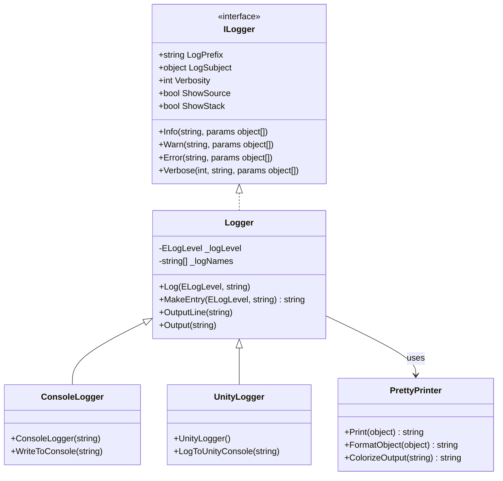
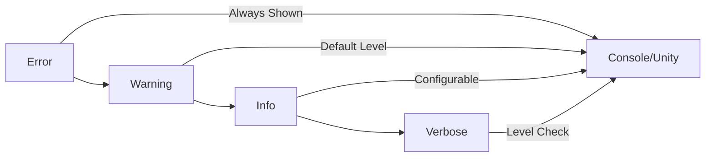

# Flow Logger Subsystem

## Overview

The Flow logging subsystem provides comprehensive logging capabilities for both Unity and standalone .NET applications. It supports multiple log levels, stack trace information, and runtime visualization of Flow execution.

## Architecture



## Components

### Logger.cs
Core logging implementation that handles message formatting, stack trace generation, and output routing. Supports both Unity and standalone environments through conditional compilation.

**Key Features:**
- Multi-level logging (Info, Warn, Error, Verbose)
- Automatic stack trace capture for debugging
- Timestamped output with execution step information
- Configurable verbosity levels

**Known Issues:**
- Complex conditional compilation logic for Unity/non-Unity environments
- Acknowledged technical debt requiring refactoring

### ConsoleLogger.cs  
Standalone console output implementation for non-Unity environments.

### UnityLogger.cs
Unity-specific logging implementation that integrates with Unity's Debug system.

### PrettyPrinter.cs
Provides formatted output for Flow objects with syntax highlighting and structured display.

## Usage

### Basic Logging
```csharp
// Set up logging
var kernel = Create.Kernel();
kernel.Log.LogPrefix = "MyApp";
kernel.Log.Verbosity = 10;

// Log at different levels
kernel.Log.Info("Application started");
kernel.Log.Warn("Low memory warning");
kernel.Log.Error("Critical error occurred");
kernel.Log.Verbose(5, "Debug information");
```

### Advanced Configuration
```csharp
// Configure detailed logging
kernel.Log.ShowSource = true;   // Show source file info
kernel.Log.ShowStack = true;    // Show stack traces
kernel.Log.LogSubject = myObject; // Set logging context
```

## Log Levels



## Visual Studio Integration

For enhanced debugging experience, use the [VSColorOutput](https://marketplace.visualstudio.com/items?itemName=MikeWard-AnnArbor.VSColorOutput) plugin:

1. Install VSColorOutput for Visual Studio
2. Copy `vscoloroutput.json` to `%AppData%\Roaming\VSColorOutput\`
3. Restart Visual Studio for colored debug output

## Performance Considerations

The `Verbose()` method evaluates all arguments regardless of verbosity level:

```csharp
// This is inefficient - ExpensiveFunction() always executes
Verbose(15, $"Debug: {ExpensiveFunction()}");

// Better approach - check level first  
if (Verbosity >= 15)
    Verbose(15, $"Debug: {ExpensiveFunction()}");
```


