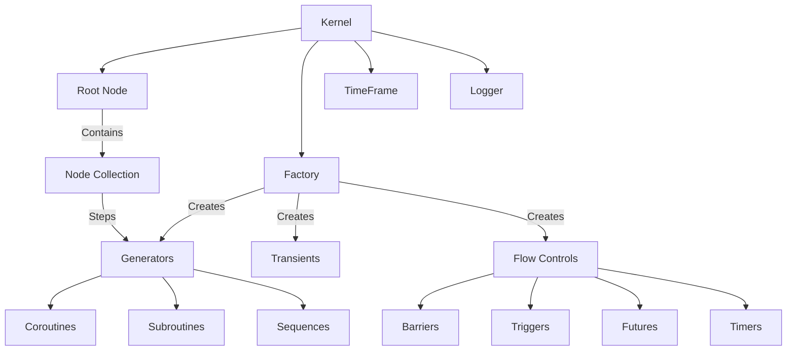
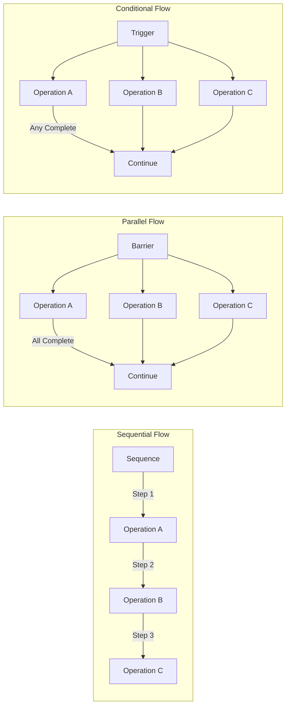
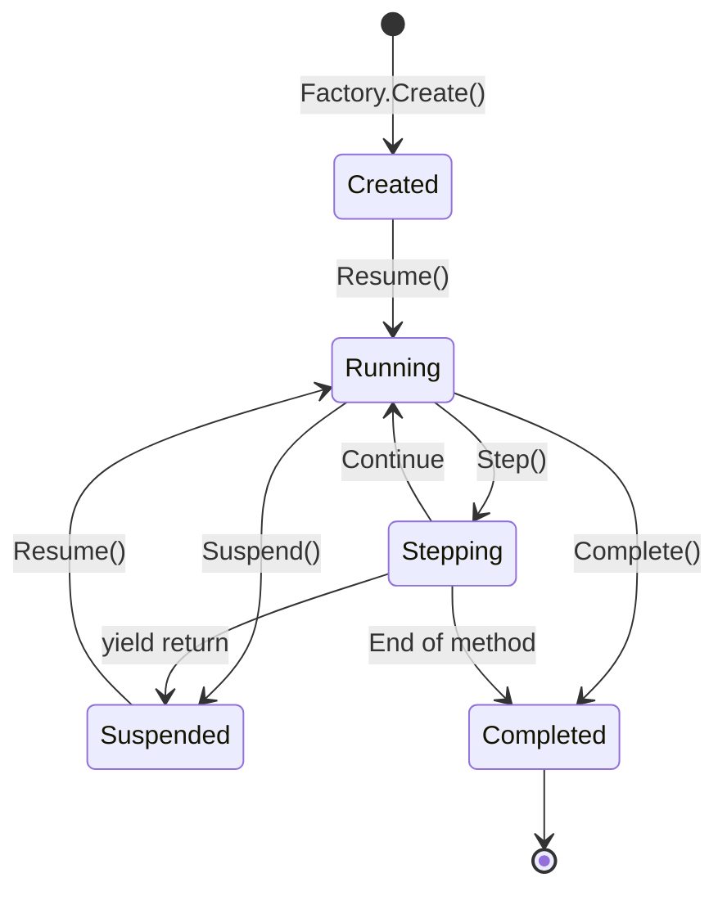
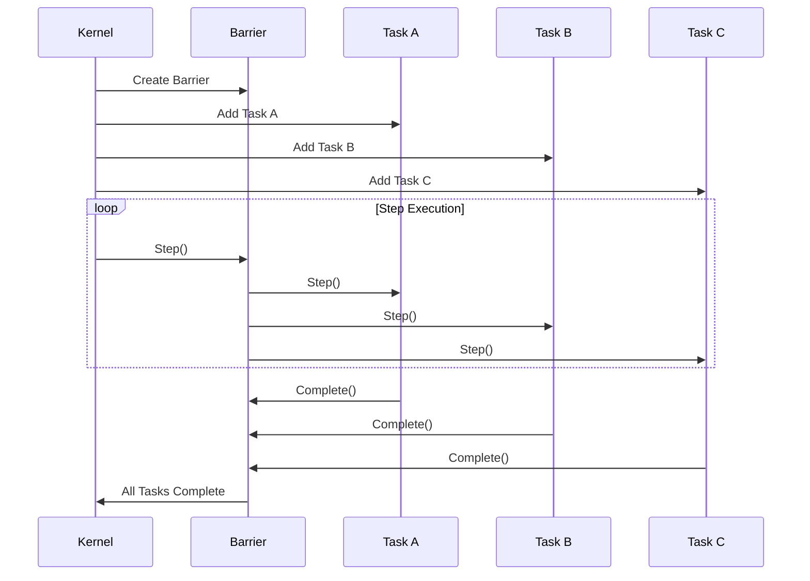
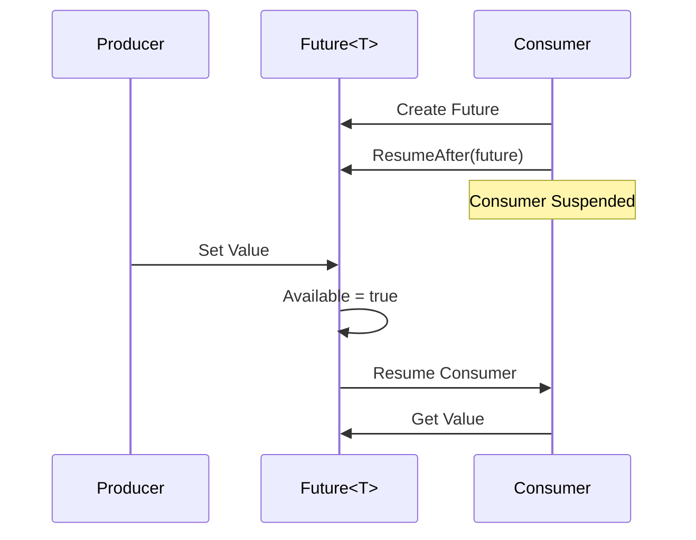
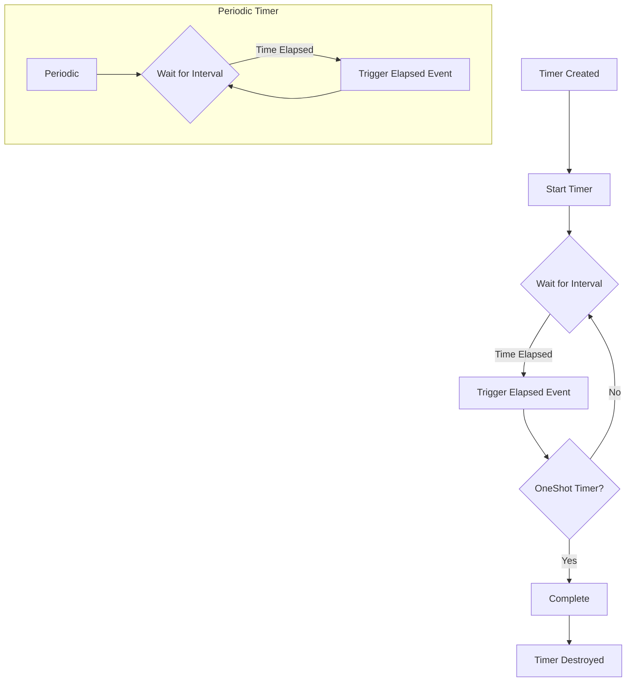
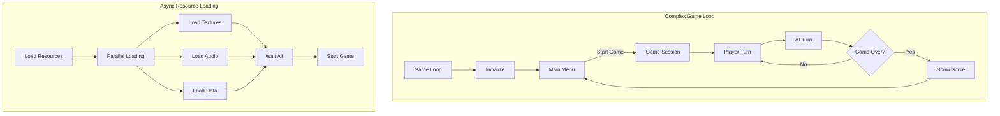
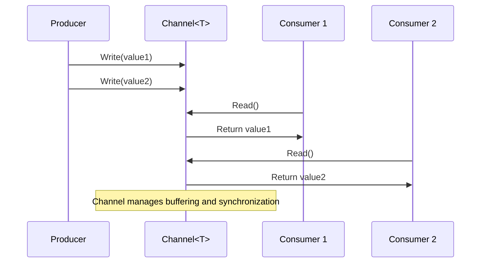
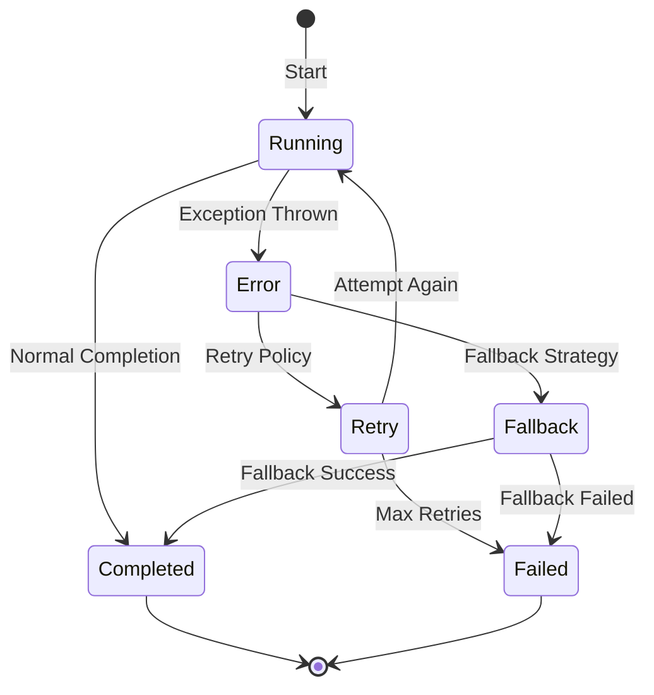

# Flow - C# Coroutine Kernel 
[](https://ci.appveyor.com/project/cschladetsch/flow)
[](https://www.codefactor.io/repository/github/cschladetsch/flow)
[](./LICENSE.txt)

A comprehensive C# coroutine-based kernel library for .NET that provides cooperative multitasking and flow control primitives. Flow enables developers to build complex async workflows using coroutines, futures, barriers, triggers, and timers.
## Key Features
- **Coroutine-based execution** - Cooperative multitasking without thread overhead
- **Rich flow control primitives** - Barriers, Triggers, Futures, Timers, Sequences
- **Unity Integration** - Full compatibility with Unity 4.0+ and modern versions
- **Event-driven architecture** - Comprehensive completion and timing event system
- **Type-safe generics** - Strongly typed futures and generators
- **Flexible factory pattern** - Easy creation and configuration of flow objects
## Quick Start
```csharp
// Create a kernel and basic coroutine
var kernel = Create.Kernel();
var coro = kernel.Factory.Coroutine(MyCoroutine);
kernel.Root.Add(coro);
// Step the kernel in your update loop
kernel.Step(); // or kernel.Update(deltaTime)
```
## Project Structure
The library is organized into logical folders:
```text
CsharpFlow/
├── Interfaces/ # All interface definitions (26 files)
│ ├── IKernel.cs # Core execution engine
│ ├── IGenerator.cs # Base execution units 
│ ├── ITransient.cs # Lifetime management
│ ├── IFactory.cs # Object creation
│ └── Flow control interfaces (IBarrier, ITrigger, IFuture, etc.)
├── Impl/ # Implementation classes (25 files) 
│ ├── Kernel.cs # Execution engine implementation
│ ├── Generator.cs # Base generator logic
│ ├── Factory.cs # Object factory
│ └── Flow control implementations
├── Logger/ # Logging subsystem
├── TestFlow/ # Comprehensive test suite
└── Properties/ # Assembly metadata
```
## Core Components
### Kernel (`Interfaces/IKernel.cs`, `Impl/Kernel.cs`)
The central execution engine that manages time and steps all active generators. Supports both delta-time and fixed-step execution.
### Generators (`Interfaces/IGenerator.cs`, `Impl/Generator.cs`)
Base execution units including coroutines, subroutines, and sequences. Support suspension, resumption, and event-driven completion.
### Factory (`Interfaces/IFactory.cs`, `Impl/Factory.cs`) 
Comprehensive object creation system with 40+ factory methods for all flow control types.
### Flow Control Primitives
- **Barriers** (`Interfaces/IBarrier.cs`) - Wait for multiple operations to complete
- **Triggers** (`Interfaces/ITrigger.cs`) - Execute when any of multiple conditions are met
- **Futures** (`Interfaces/IFuture.cs`) - Represent values that will be available in the future
- **Timers** (`Interfaces/ITimer.cs`) - Schedule time-based execution
- **Sequences** (`Interfaces/ISequence.cs`) - Execute operations in order
## Documentation
Current documentation is available at [GamaSutra](http://www.gamasutra.com/view/news/177397/Indepth_Flow__A_coroutine_kernel_for_Net.php) (note: formatting may be inconsistent).
The original detailed post was published on AltDevBlogADay but is no longer available.
## Testing
The [tests](TestFlow/Editor) are located in `TestFlow/Editor/` for Unity compatibility. The test suite covers:
- Kernel execution and stepping
- Coroutine lifecycle management 
- Barriers and synchronization primitives
- Future and timer functionality
- Channel communication
- Flow control structures
Run tests using your preferred NUnit test runner. These tests serve as both validation and usage examples.
## Usage Examples
### Basic Timer Example
```csharp
private void CreateHeartbeat()
{
    New.PeriodicTimer(TimeSpan.FromMinutes(2)).Elapsed += tr =>
    {
        Get<UserCount>("user/alive").Then(result =>
        {
            if (result.Succeeded(out var val))
            {
                _activeUsers.Value = val.Num;
                Info($"{val.Num} users online.");
            }
        });
    };
}
```
### Game Loop with Sequences and Barriers
```csharp
public void GameLoop()
{
    Root.Add(
        New.Sequence(
            New.Coroutine(StartGame).Named("StartGame"),
            New.While(() => !_gameOver,
                New.Coroutine(PlayerTurn).Named("Turn")),
            New.Coroutine(EndGame).Named("EndGame")
        ).Named("GameLoop")
    );
}
```
### Complex Barrier Synchronization

```csharp
private IEnumerator StartGame(IGenerator self)
{
    var start = New.Sequence(
        New.Barrier(
            WhitePlayer.StartGame(),
            BlackPlayer.StartGame()
        ).Named("Init Game"),
        New.Barrier(
            WhitePlayer.DrawInitialCards(),
            BlackPlayer.DrawInitialCards()
        ).Named("Deal Cards"),
        New.Barrier(
            New.TimedBarrier(
                TimeSpan.FromSeconds(Parameters.MulliganTimer),
                WhitePlayer.AcceptCards(),
                BlackPlayer.AcceptCards()
            ).Named("Mulligan"),
            New.Sequence(
                WhitePlayer.PlaceKing(),
                BlackPlayer.PlaceKing()
            ).Named("Place Kings")
        ).Named("Preceedings")
    ).Named("Start Game");
    start.Completed += (tr) => Info("StartGame completed");
    yield return start;
}
```
### Debugging and Tracing
The `.Named()` extension method enables debugging and tracing. The library provides extensive runtime visualization to monitor kernel execution in real-time.
## Architecture
Flow uses a composition-based approach combining various flow control primitives. Below are the architectural diagrams for the major systems:
### Core System Architecture

### Flow Control Primitives

### Generator Lifecycle

### Barrier Synchronization

### Future/Promise Pattern

### Timer Execution Flow

This architecture eliminates the need to manually track state across update calls in game loops or async workflows.
### Advanced Flow Patterns

### Channel Communication

### Error Handling Flow

## Installation
### Unity
1. Clone or download this repository
2. Copy the `Flow` folder into your Unity project's `Assets` folder
3. The library will be automatically recognized via the included `.asmdef` files
### .NET Projects
1. Clone the repository
2. Build the `Flow.sln` solution
3. Reference the compiled `Flow.dll` in your project
Alternatively, you can include the source files directly in your project.
## Performance Notes
### Verbose Logging
The `Verbose()` logging method evaluates all arguments even when the verbosity level would prevent output. Use caution with expensive operations:
```csharp
Verbosity = 10;
Verbose(15, $"Result: {ExpensiveFunction()}"); // ExpensiveFunction() still executes!
```

For performance-critical code, check verbosity levels before logging:

```csharp
if (Verbosity >= 15)
    Verbose(15, $"Result: {ExpensiveFunction()}");
```
## Requirements
- .NET Framework 4.8 or later
- Unity 4.0+ (for Unity integration)
- NUnit (for running tests)
