# Flow Testing Documentation
## Overview
The Flow library includes a comprehensive test suite located in `TestFlow/Editor/` that validates all major components and flow control patterns. The tests are designed to run in both Unity's Test Runner and standard NUnit environments.
## Test Architecture
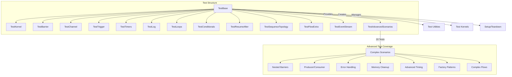
## Test Categories
### Core System Tests
#### TestKernel.cs
Tests the fundamental execution engine functionality:
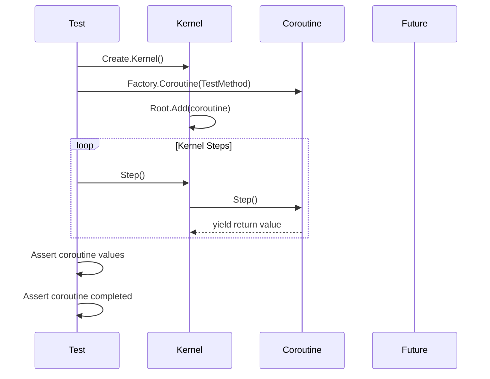
**Key Test Scenarios:**
- Coroutine lifecycle (creation, execution, completion)
- Future value setting and availability
- Generator stepping and value progression
- Kernel state management
#### TestBarrier.cs
Validates synchronization primitive behavior:
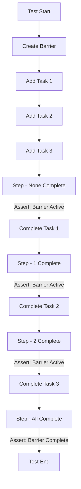
#### TestChannel.cs
Tests inter-generator communication:
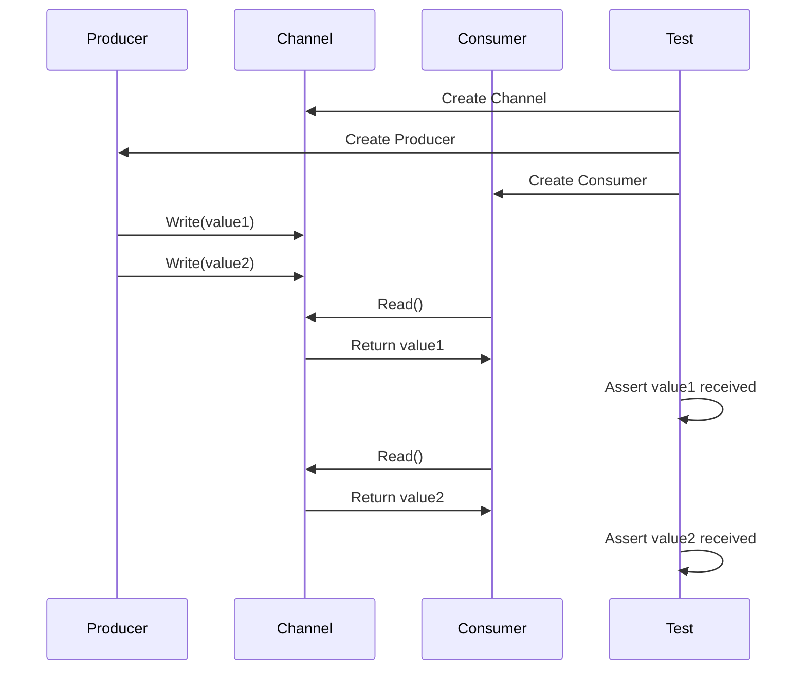
### Flow Control Tests
#### TestTrigger.cs
Validates "any of" completion semantics:
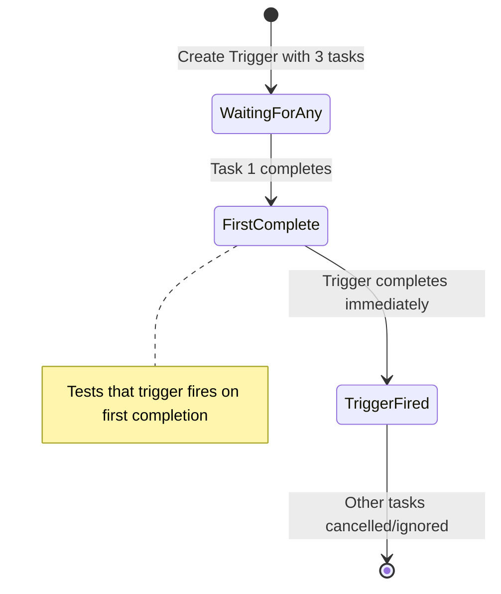
#### TestTimers.cs
Tests time-based execution patterns:
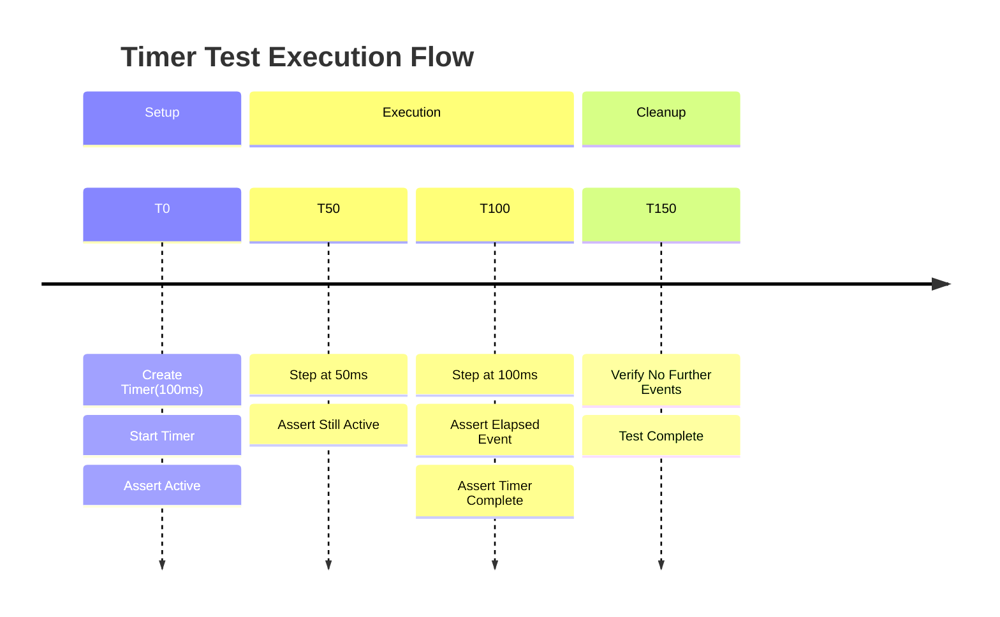
### Advanced Pattern Tests
#### TestSequenceTopology.cs
Tests complex nested sequence patterns:
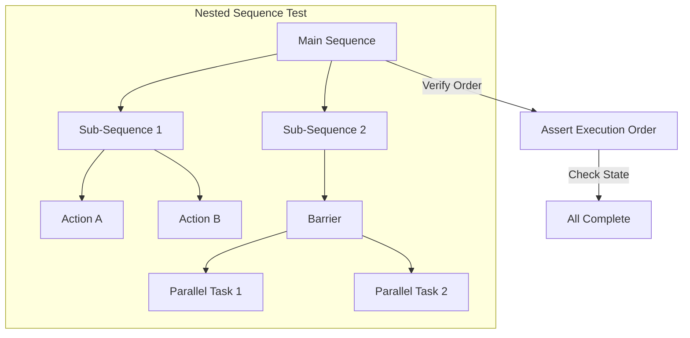
#### TestResumeAfter.cs
Tests dependency-based execution control:
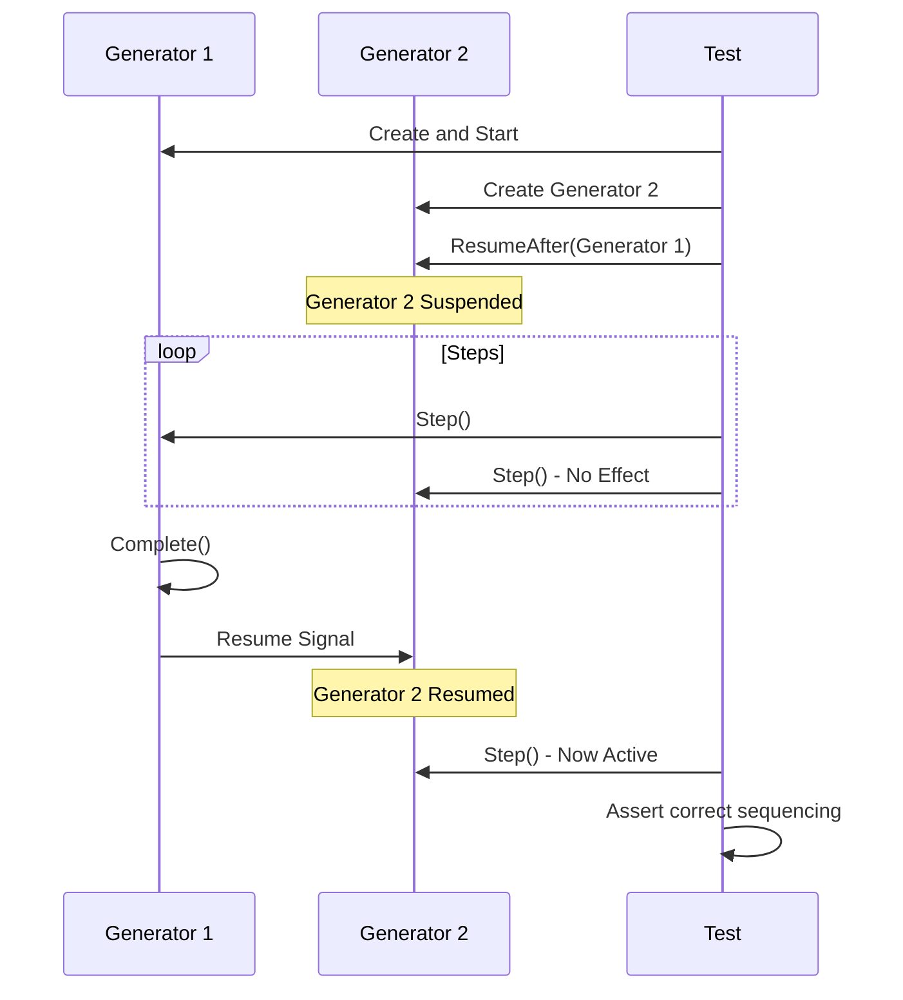
## Test Execution Patterns
### Synchronous Testing
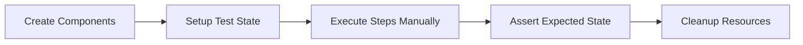
### Asynchronous Pattern Testing
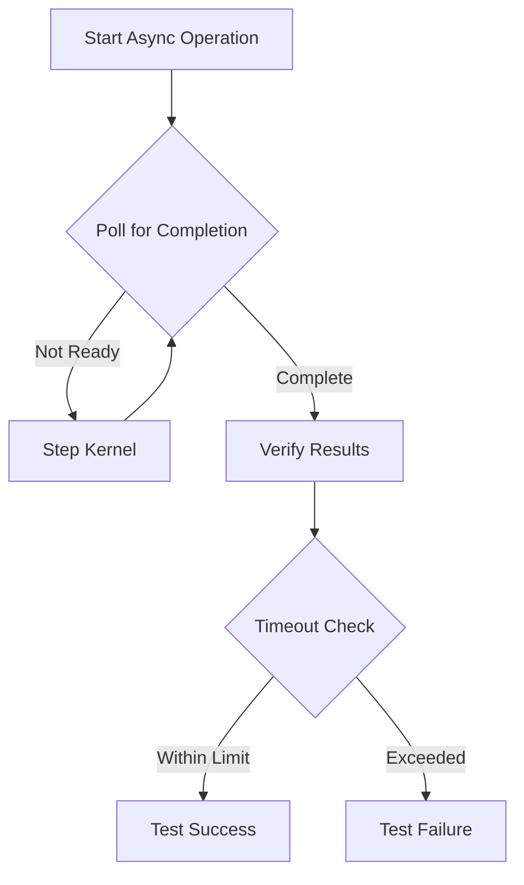
## Running Tests
### Unity Environment
```csharp
// Tests run automatically in Unity Test Runner
// Located in TestFlow/Editor/ for Unity compatibility
// Use Window > General > Test Runner in Unity
```
### Standalone NUnit
```bash
# Run via NUnit test runner
nunit-console TestFlow.dll
# Or via Visual Studio Test Explorer
# Build solution and run all tests
```
### Test Configuration
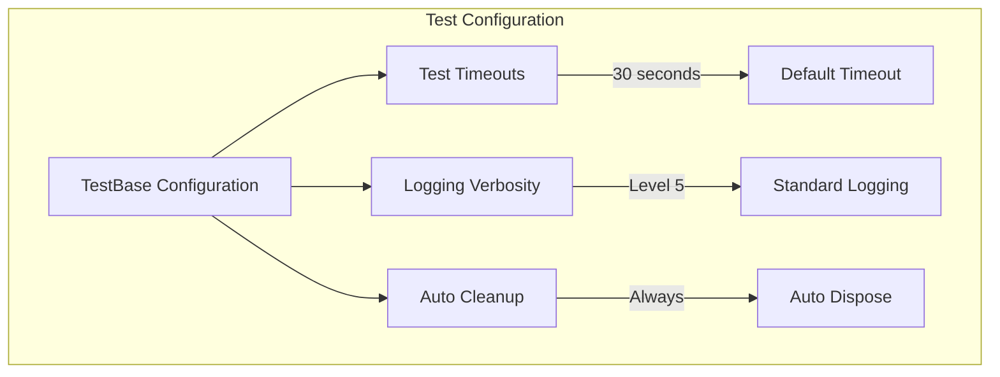
## Test Coverage Matrix
| Component | Unit Tests | Integration Tests | Performance Tests | Advanced Scenarios |
|-----------|------------|-------------------|-------------------|--------------------|
| Kernel | Basic execution | Multi-generator | Limited | Break mechanism |
| Generators | Lifecycle | Nesting | Limited | Suspend/Resume |
| Barriers | Synchronization | Timeout handling | None | Nested barriers |
| Triggers | Any-completion | Complex scenarios | None | Multiple sources |
| Futures | Value setting | Chaining | None | Timed futures |
| Timers | Basic timing | Periodic behavior | Limited | Multiple ticks |
| Channels | Read/Write | Producer/Consumer | None | Advanced patterns |
| Sequences | Ordering | Nested sequences | None | Deep nesting |
| Logging | Basic output | Limited | None | Limited |
| Factory | Object creation | Limited | None | All patterns |
| Error Handling | Basic | Limited | None | Coroutine errors |
| Memory Management | Basic cleanup | None | None | Completion cleanup |
**Legend:**
- Comprehensive coverage
- Partial coverage 
- No coverage
## Common Test Patterns
### Setup Pattern
```csharp
[SetUp]
public void SetUp()
{
kernel = Create.Kernel();
kernel.Log.Verbosity = 0; // Quiet during tests
factory = kernel.Factory;
}
```
### Assertion Helpers
```csharp
protected void AssertCompleted(ITransient transient, string context = "")
{
Assert.IsFalse(transient.Active, $"Expected {context} to be completed");
}
protected void AssertActive(ITransient transient, string context = "")
{
Assert.IsTrue(transient.Active, $"Expected {context} to be active");
}
```
### Timeout Protection
```csharp
protected void StepUntilComplete(ITransient target, int maxSteps = 1000)
{
int steps = 0;
while (target.Active && steps < maxSteps)
{
kernel.Step();
steps++;
}
Assert.IsFalse(target.Active, $"Operation did not complete within {maxSteps} steps");
}
```
### Advanced Scenario Tests
#### TestAdvancedScenarios.cs (20 New Tests)
Comprehensive test suite covering complex scenarios and edge cases:
**Nested and Complex Flow Tests:**
- `TestNestedBarriersWithTimeout()` - Tests complex barrier hierarchies with timeout handling
- `TestComplexSequenceWithConditionals()` - Validates conditional execution within sequences
- `TestDeepNestedSequences()` - Tests deeply nested sequence structures
- `TestComplexFlowWithAllPrimitives()` - Integration test using all flow control types
**Producer/Consumer and Communication:**
- `TestChannelProducerConsumerPattern()` - Advanced channel communication patterns
- `TestConcurrentBarrierAndTrigger()` - Tests interaction between barriers and triggers
**Timing and Synchronization:**
- `TestPeriodicTimerWithMultipleTicks()` - Multi-tick periodic timer validation
- `TestTimedFutureTimeout()` - Timed future timeout behavior
- `TestWaitMechanism()` - Kernel wait functionality
**Error Handling and Edge Cases:**
- `TestErrorHandlingInCoroutines()` - Exception handling within coroutines
- `TestKernelBreakMechanism()` - Kernel break functionality
- `TestMemoryCleanupOnCompletion()` - Resource cleanup validation
**Factory and API Patterns:**
- `TestFactoryCreationPatterns()` - Comprehensive factory method testing
- `TestFluentInterfaceChaining()` - Fluent API pattern validation
- `TestValueExpression()` - Value and expression generator testing
**Advanced Dependency Management:**
- `TestGeneratorSuspendResumeWithDependencies()` - Complex dependency scenarios
- `TestTriggerWithMultipleCompletionSources()` - Multi-source trigger patterns
- `TestActionSequencePattern()` - Action sequence functionality
- `TestGeneratorNamingAndDebugging()` - Debug and naming support
## Known Test Limitations
1. **Performance Benchmarks**: No automated performance regression testing
2. **Stress Testing**: Limited high-load scenario coverage (improved with new tests)
3. **Memory Leak Detection**: Basic cleanup testing (enhanced with new memory tests)
4. **Timing Sensitivity**: Timer tests may be sensitive to execution timing
5. **Thread Safety**: No multi-threaded testing scenarios
## Contributing Tests
When adding new tests, follow these patterns:
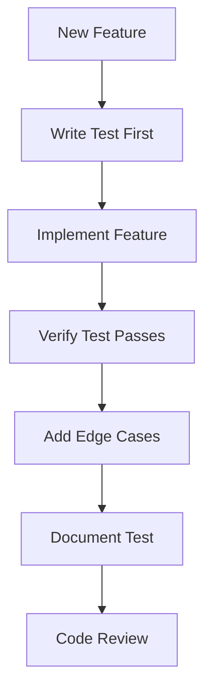
### Test Naming Convention
- `Test[ComponentName]` for component tests
- `Test[Feature][Scenario]` for specific scenarios
- Use descriptive method names: `TestBarrierCompletesWhenAllTasksFinish()`
### Test Structure
1. **Arrange**: Set up test conditions
2. **Act**: Execute the operation
3. **Assert**: Verify expected outcomes
4. **Cleanup**: Dispose resources (handled by TestBase)